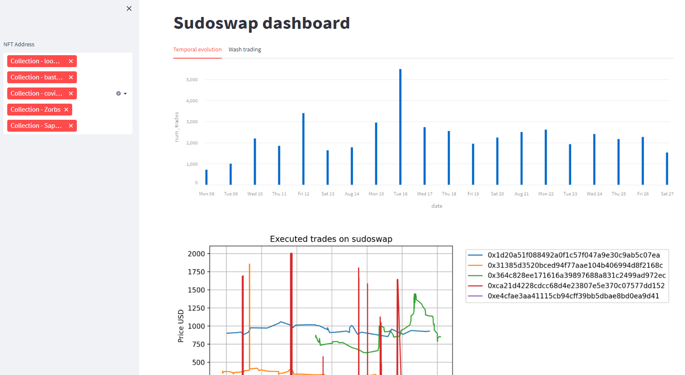
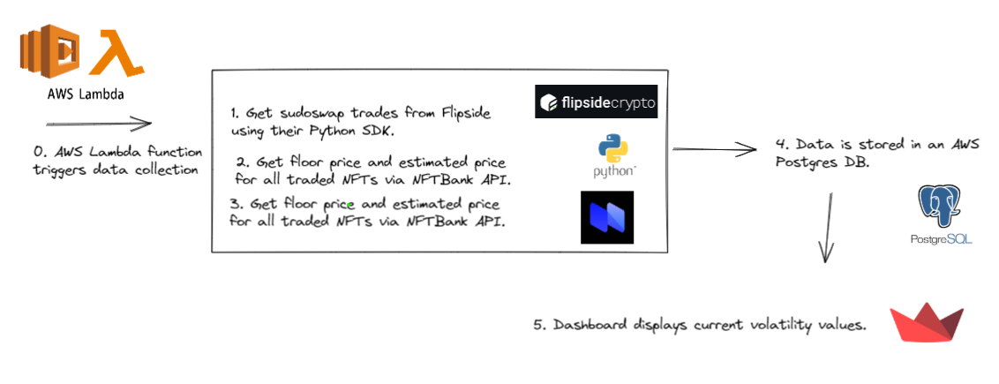

# Sudoswap trade analysis

[Dashboard](ec2-3-91-153-12.compute-1.amazonaws.com:8501/)



## Tools used



Sudoswap Explorer is a dashboard for visualizing trading activity on sudoswap. It's complementary to other dashboards, such as on Dune ([link](https://dune.com/0xRob/sudoamm)).

The project has 3 main components:

- Data fetching: 
  - Sudoswap trades are being fetched from Flipside using their [SDK](https://sdk.flipsidecrypto.xyz/shroomdk)
  - Floor- and estimate prices for each NFT collection present in the trading data is fetched from [NFTBank.ai](https://docs.nftbank.ai/) using their Python SDK. Both data sources are stored in an AWS Postgres instance.
- Data processing: we investigate the concept of wash trading (as explained in this [tweet](https://twitter.com/nansen_ai/status/1491095672506187776?s=20&t=flOqUxzV0vMW4ZS-c-2bMQ) from Nansen). The basic idea is that one trader is trading the same NFT using two distinct wallets, thus making it seems like there is more trading activity for a given NFT than there actually is. Those trades also occur within a short time difference of each other. For our example, we consider a trade of type "wash trade" when two addresses trade the same NFT address back-and-forth (i.e. 2 trades) within a 1h period.
- Data visualization: we build a dashboard [link](ec2-3-91-153-12.compute-1.amazonaws.com:8501/) for visualizing trading activity (incl. price estimates of each NFT collection) as well as wash trading activities.


## Getting started

### Environment variables

Set the appropriate values in the sample.env and rename it to .env.
An API key for ShroomSDK (from Flipside crypto) is also needed.

### Data fetching

To fetch all data, install Python (we suggest Miniconda) and run
```
conda create -n sudoswap python=3.9
conda activate sudoswap
cd <repo-root>
pip install -r requirements.txt
cd data_fetching
python main.py
```

### Starting dashboard locally

Assuming you installed the dependencies as described in the previous step, now run:

```
cd dashboard
streamlit run app.py
```
